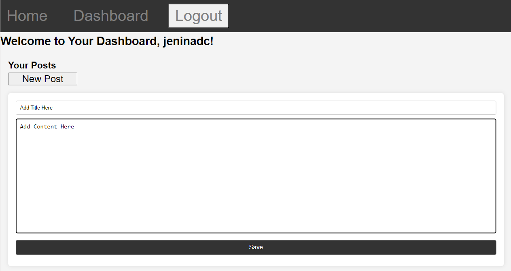
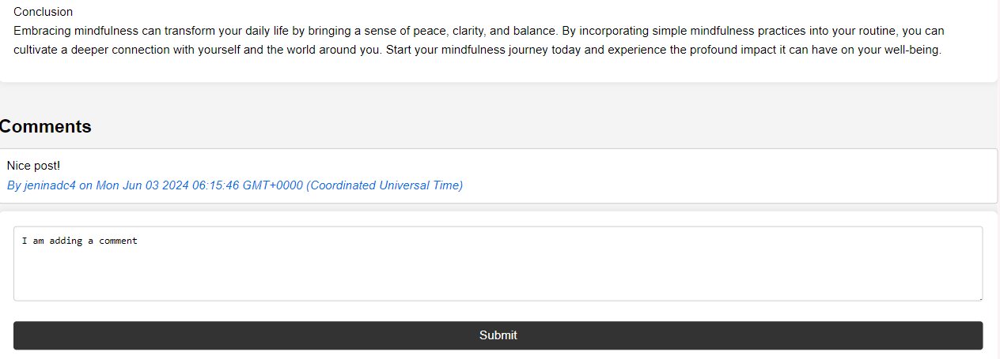
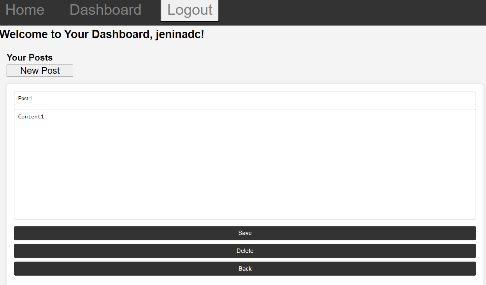

# CMS Style Blog Site Challenge   
# [VIEW DEPLOYED APPLICATION HERE!!!](https://cms-style-blog-site-18a70dcd692d.herokuapp.com)

## Table of Contents
- [Description](#description)
- [Installation](#installation)
- [Usage](#usage)
- [Contributors](#contributing)
- [Tests](#tests)
- [License](#license)
- [Questions](#questions)

## Description
This application presents a CMS-style blog site similar to a Wordpress site, where users can publish their blog posts and comment on other users’ posts as well. This app follows the MVC paradigm in its architectural structure, using Handlebars.js as the templating language, Sequelize as the ORM, and the express-session npm package for authentication.

## Installation
To install the application, simply navigate to deployed app: https://cms-style-blog-site-18a70dcd692d.herokuapp.com

## Usage
To use the application, sign up to create user credentials. Once logged in, create new post to appear in your dashboard. User can also comment on other post, as well as edit and delete their own posts.

## Contributing
Contributions are welcome!

## License 
  This application is covered under license none.
  For more information about the license, visit: [none]() or click the badge on top.

## Questions
  My GitHub profile is: Jenina52112 [View on GitHub](https://github.com/Jenina52112)

  For additional questions, contact me at email address: jeninadelacruz521@yahoo.com

